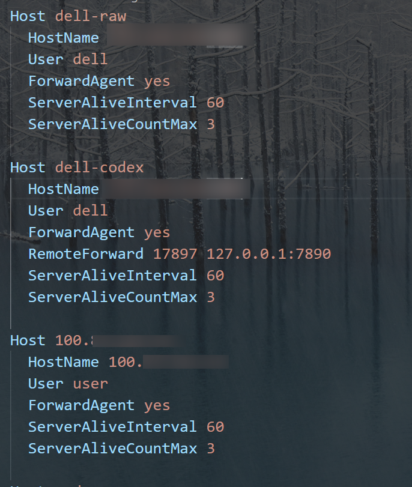

# 科研自动化——Server Live Sync

[English](#english) | 中文

### 动机

为什么会有这个 Skill？在做科研时，很多伙伴的代码都在服务器上。服务器端的 Agent 负责编写代码，本地 Agent 负责提供 idea。我们希望把服务器产生的中间文档和训练日志实时同步到本地，让本地 Agent 阅读并协助验证下一步想法，因此让 Codex 编写了这个 Skill。

### 作用

用 Syncthing 在 Linux 服务器和本地电脑之间双向实时同步项目。两端默认都设为 `sendreceive`：本地修改会传到服务器，服务器修改也会传回本地。

每个项目只需配置一次。以后任意一端新增、修改、重命名或删除文件，另一端都会自动跟进。电脑关机期间不会同步；重新开机并连接后会补齐变化。

## 安装

把下面这句话发给 Codex：

```text
请从 GitHub 安装 server-live-sync skill：
https://github.com/Takizzl/server-live-sync/tree/main/skill/server-live-sync
```

安装完成后，在下一轮对话中使用 `$server-live-sync`。

也可以通过 Codex 自带的 skill installer 安装：

```bash
python ~/.codex/skills/.system/skill-installer/scripts/install-skill-from-github.py \
  --repo Takizzl/server-live-sync \
  --path skill/server-live-sync
```

## 使用前准备

本地电脑需要：

- Python 3.9 或更高版本
- `ssh`、`scp` 和 `syncthing` 命令
- 能通过 SSH 登录目标服务器

服务器需要安装 Syncthing，并且待同步项目已经存在。脚本不会替你创建远端项目，也不会调用 `sudo`。

常见安装命令：

```powershell
# Windows
winget install Syncthing.Syncthing
```

```bash
# Ubuntu / Debian
sudo apt install syncthing

# macOS
brew install syncthing
```

## 让 Codex 配置同步

配置时需要说清楚三件事：服务器项目路径、SSH 主机和本地保存路径。

### 服务器项目路径

例如：

```text
/home/alice/projects/vla
```

### SSH 主机

`gpu-box` 是 SSH 主机，可以是服务器 IP、域名，也可以是 `~/.ssh/config` 中配置的别名。Windows 的 SSH 配置文件通常位于 `C:\\Users\\taki\\.ssh\\config`，taki是电脑用户名

下面是 Windows SSH 配置示例：

<p align="center">
  
</p>

### 本地保存路径

在 Windows 上：

- 放到 D 盘，必须明确写成 `D:\Projects\vla`

本地路径可以自由更换，文件夹名称也不必与服务器项目名一致。建议 Windows 用户直接提供完整路径。

### 发给 Codex 的命令

```text
使用 $server-live-sync，把 gpu-box 上 /home/alice/projects/vla
和本地 D:\Projects\vla 双向实时同步
```

Codex 会先运行 dry-run，展示服务器路径、本地路径和两端文件夹类型。确认没有问题后，它会配置两端 Syncthing、配对设备并检查同步状态。

如果本地文件夹要换名字，例如保存为 `my-vla`：

```text
使用 $server-live-sync，把 gpu-box 上 /home/alice/projects/vla
和本地 D:\Projects\my-vla 双向同步
```

在 Linux 或 macOS 上，也可以写成 `~/code/vla`；它会展开为当前用户主目录下的 `code/vla`。

## 开关机后会自动同步吗？

正式配置时，skill 会尝试为两端设置自动启动：

- Windows：把 `Start-Syncthing.vbs` 放进当前用户的“启动”文件夹，登录 Windows 后启动 Syncthing。
- Linux 服务器：运行 `systemctl --user enable --now syncthing.service`。
- macOS：通过 `brew services` 启动 Syncthing。

同步项目会保存在 Syncthing 配置中。正常情况下，每个项目只需配置一次，电脑或服务器重启后不用重新添加。

服务器使用 systemd 时，还要确认用户的 `Linger` 已开启。登录服务器后运行：

```bash
systemctl --user is-enabled syncthing.service
systemctl --user is-active syncthing.service
loginctl show-user "$USER" -p Linger
```

正常结果应包含 `enabled`、`active` 和 `Linger=yes`。如果服务没有启用，运行：

```bash
systemctl --user enable --now syncthing.service
```

如果显示 `Linger=no`，服务器管理员需要运行：

```bash
sudo loginctl enable-linger alice
```

把 `alice` 换成实际的服务器用户名。skill 不会自行调用 `sudo`。没有管理员权限时，需要联系服务器管理员开启 Linger。否则 Syncthing 可能要等用户登录服务器后才启动。

Windows 的启动项在用户登录后运行，不是在登录界面运行。可以按 `Win+R`，输入 `shell:startup`，检查里面是否有 `Start-Syncthing.vbs`。

任意一端关机时，同步会暂停。两端重新上线后会自动补齐变化，不用再次运行配置命令。

## 直接运行脚本

通常交给 Codex 操作即可。排查问题时，可以手动运行：

```bash
# 检查本地、SSH 和服务器依赖
python scripts/live_sync.py doctor --ssh-host gpu-box

# Linux / macOS：只检查计划，不修改配置
python scripts/live_sync.py add \
  --ssh-host gpu-box \
  --remote-root /home/alice/projects \
  --project vla \
  --local-root ~/code \
  --mode bidirectional \
  --dry-run
```

```powershell
# Windows：只检查计划，不修改配置
python scripts/live_sync.py add --ssh-host gpu-box --remote-root /home/alice/projects --project vla --local-root 'D:\Projects' --mode bidirectional --dry-run

# Windows：正式配置
python scripts/live_sync.py add --ssh-host gpu-box --remote-root /home/alice/projects --project vla --local-root 'D:\Projects' --mode bidirectional
```

脚本可以重复执行。已有配置匹配时，它会验证和修复状态，不会重复创建同步项。

### 把旧版单向项目改成双向

旧版 skill 使用服务器 `sendonly`、本地 `receiveonly`。新版 dry-run 会列出需要修改的方向，但不会自动迁移。先暂停两端编辑，并用 Git 提交或备份重要文件，再执行：

```powershell
python scripts/live_sync.py add --ssh-host gpu-box --remote-root /home/alice/projects --project vla --local-root 'D:\Projects' --mode bidirectional --allow-mode-change
```

如果只想保留原来的服务器到本地单向镜像，使用 `--mode mirror`。

## 默认不会同步的内容

默认排除以下内容：

- Git 内部数据、Python 缓存和编辑器缓存
- `node_modules`、`.venv` 和 `venv`
- `.pt`、`.pth`、`.ckpt`、`.safetensors`、`.onnx` 等模型文件
- 压缩包和常见视频文件

`.py`、`.json`、`.yaml`、`.sh`、`.md` 和 `.log` 等代码与日志文件会正常同步。skill 会在两端分别安装默认 `.stignore`；任意一端已有该文件时都会保留，不会覆盖。

## 安全设计

- 一次只配置一个明确项目，不镜像整个 home 目录。
- 双向模式会把本地修改和删除传播到服务器，也会把服务器变化传播到本地。
- 两端同时修改同一文件时，Syncthing 可能生成 `.sync-conflict-*` 冲突副本，需要人工合并。
- 不调用 Syncthing 的 `folder-override` 操作。
- 拒绝 `..` 路径穿越、宽泛目录和冲突配置。
- 脚本不会直接删除或改写项目代码；同步产生的删除仍会传播到另一端。

## 常见问题

### 本地关机后会丢文件吗？

不会。服务器继续记录变化，本地重新上线后会补同步。如果某个临时文件在本地离线期间创建后又被删除，本地不会看到这个短暂存在的文件。

### 两端同时修改同一个文件怎么办？

Syncthing 会保留一个版本，并把另一个版本重命名为 `.sync-conflict-*` 文件。检查差异、手动合并，然后删除不需要的冲突副本。代码项目仍建议使用 Git 提交重要修改。

### 为什么显示设备未连接？

先运行：

```bash
python scripts/live_sync.py doctor --ssh-host gpu-box
```

确认两端 Syncthing 正在运行，并检查防火墙是否允许 Syncthing 连接。即使无法直连，Syncthing 通常也可以通过中继连接。

### 能同步数据集和模型权重吗？

默认不行，这是为了避免意外下载几十 GB 的文件。确实需要时，复制 `scripts/default.stignore`，删掉对应规则，然后通过 `--ignore-file` 使用自定义文件。

## English

### Motivation

Research work often spans two machines. An agent on the server writes code and runs experiments, while an agent on the local computer reads intermediate notes and training logs to analyze results and suggest the next experiment. Server Live Sync keeps those files available locally as they change.

### What it does

The skill uses Syncthing to synchronize one explicit project between an SSH-accessible Linux server and a local Windows, Linux, or macOS computer. Bidirectional mode is the default, with both folders set to `sendreceive`.

Each project is configured once. New files, edits, renames, and deletions on either device are then reflected on the other. If either computer is offline, synchronization pauses and catches up when both devices reconnect. Use `--mode mirror` when the server must remain the sole source.

### Installation

Install it by asking Codex:

```text
Install the server-live-sync skill from:
https://github.com/Takizzl/server-live-sync/tree/main/skill/server-live-sync
```

After installation, invoke the skill as `$server-live-sync` in a new turn.

#### Prerequisites

The local computer needs Python 3.9 or later, SSH, SCP, Syncthing, and working SSH access to the server. Syncthing must also be installed on the server, and the remote project directory must already exist. The skill does not create remote projects or run `sudo` on its own.

### Configure a project

Tell Codex three things:

- the SSH host, such as an IP address, domain name, or alias from `~/.ssh/config`
- the absolute remote project path, such as `/home/alice/projects/vla`
- the local destination, such as `D:\Projects\vla`

On Windows, the SSH configuration file is normally under `C:\Users\<username>\.ssh\config`. Replace `<username>` with the Windows account name.

Then ask Codex:

```text
Use $server-live-sync to bidirectionally sync gpu-box:/home/alice/projects/vla with D:\Projects\vla.
```

The local folder name does not need to match the remote project name. On Windows, use an explicit absolute path when the destination is on another drive.

Codex first runs a dry-run and reports the resolved paths and folder types. It then pairs the devices, configures both folders, and verifies their health.

To convert an existing one-way mirror, stop editing on both devices and commit or back up important files. Review the dry-run, then rerun with `--mode bidirectional --allow-mode-change`. Direction changes are never applied silently.

### Startup after reboot

The skill enables the Syncthing user service on a systemd-based server and configures local startup where supported. On Windows, Syncthing starts after the user signs in.

Check a systemd server with:

```bash
systemctl --user is-enabled syncthing.service
systemctl --user is-active syncthing.service
loginctl show-user "$USER" -p Linger
```

Startup without an SSH login requires `enabled`, `active`, and `Linger=yes`. If Linger is disabled, an administrator can run `sudo loginctl enable-linger alice`, replacing `alice` with the server username. The skill never runs `sudo` by itself.

### Default exclusions and safety

Model weights, archives, videos, caches, dependencies, and virtual environments are excluded by default. Source files, configuration files, documentation, and logs remain included. The skill installs default `.stignore` rules independently on both devices and never overwrites an existing file. Bidirectional mode propagates deletions. Simultaneous edits may create `.sync-conflict-*` files that must be merged manually, so important code changes should still be committed with Git.

## License

MIT
